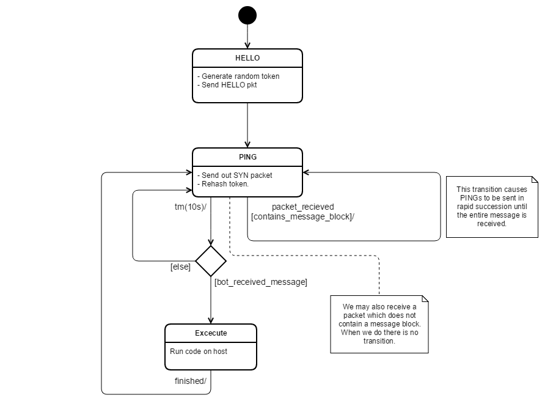
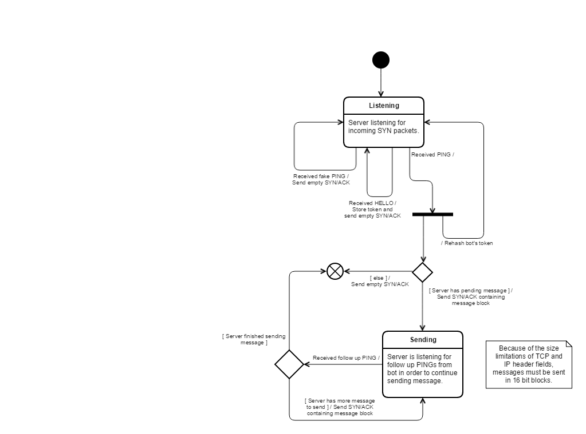

# The Project

This project deals in the subject of botnets. Specifically, creating a method of
communication between bot and server which does not expose the server's location. The
reason hiding the Command and Control server's location is so critical in botnets is
because once a C&C server is located, it can easily be shut down by the authorities. This
subsequently shuts down the entire botnet. Now it is true that an individual can
configure a firewall that blocks bots communicating from their host (by simply blocking
the port it uses for example). However, this does not concern us because we are certain
that there will be many more hosts who's owners are less capable of doing so.

# The Goal

The goal of the project is to develop a communication protocol which obscures our server's location,
without using P2P networks or TOR. We will achieve this by hiding
our server amongst many other legitimate web servers. So that someone monitoring network
traffic will not be able to tell which server the message is coming from. As for the
method of data transfer, we chose to communicate entirely through Syn and Syn/Ack packets.
The reason for this is that firewalls for the most part cannot block these packets since
they are so essential for almost all internet communication (TCP in general). We use the
packet's TCP headers as carriers for our message by embedding them with our encrypted
message data. This way a Syn/Ack carrying a message is completely indistinguishable from a
standard web server Syn/Ack. The end result looks as follows:

1. Bot sends (identical) SYN packets to multiple web servers (on port 80).
2. All servers respond with standard SYN/ACK packets.
3. The above steps are repeated several times, at the end of which our bot has the completed message.
4. Anyone monitoring the network will not be able to tell which server our bot received
the message from, or how the message was transmitted.

__*WARNING: From here on it is very technical*__

# The Protocol

*For the implementation of our protocol we have chosen to embed all protocol data in the
TCP-ISN and IPID header fields since they have an initial value of random. This makes
them ideal carriers for covert communication.*

*We will now define the protocol. The protocol will consist of 3 phases*

## HELLO

*The purpose of this phase is to notify the server of a new (or renewed) bot up and
running. During this phase the server stores a token that will later serve to
authenticate our bot to the server. The purpose of the token is to make it harder for an
outsider to trigger a response from our server and thereby identify it as the C&C of our
botnet. This phase happens once in the client program's lifetime.*

#### The play by play

1. Bot generates a random 32 bit integer and sets it as the TCP Sequence Number in the outgoing packet.
2. Bot hashes the previously generated integer and stores it as its current token. It also puts the 16 least significant bits of the token in the IPID field of the packet, and sends the packet (with SYN flag set) to all servers.
3. Our server receives the packet and hashes the TCP sequence number. If the 16 bits of the IPID match the 16 LSBs of the hash, this confirms (to a certain extent) that we are talking with one of our bots.
4. The server then stores the hash (bot's current token) for later authentication.

__*Note*__: In order for an outsider to pose as a bot they must now know **1)** That this phase exists. (They may simply think it's a standard PING.) **2)** How to formulate the HELLO packet with the proper IPID. **3)** Our particular hash algorithm.

## PING

*A periodic SYN packet sent by the bot (to all servers), to check if there are pending messages from the server (such as code to be run).*

#### The play by play

1. In each ping (SYN packet) the bot puts the 16 LSBs of the current token (so as not to expose the entire token over the network each time) in the TCP Sequence Number, rehashes the token, and sends the packet.
2. When our server receives the SYN it goes through its list of tokens and checks if the Sequence Number it received is among them (in reality there are a couple extra technicalities involved here). If it is, the server simply rehashes the existing token and stores it (to stay up to date with the bot). If the sequence number is not among its list of tokens then we are not dealing with one of our bots and an empty SYN/ACK packet is returned, and nothing more is done.
3. If our server has no message for the bot, an empty SYN/ACK packet is returned. If, however, there is a message pending, then we move on to the transmission phase.

## Transmission

*This is the phase in which the bot actually receives message data from the server.*

__*Note*__: Since in reality our server has many bots to cater to, once the protocol reaches this phase, the server opens up a new thread to send the message to the bot and goes back to listening on the main thread.

#### The play by play

1. The server places the 16 MSBs of the current token into the 16 MSBs of TCP Sequence Number.
2. The server encrypts the next block of 128 bits of the message (symmetric encryption) starts sending that segment in 16 bit blocks. (That means over the course of 8 packets)
3. Our bot does not know which server is the one responding, and because each incoming packet will be from a new TCP connection (SYN) it must be able to locate the correct packet for each incoming block (16bits). To do this it will check to see if the 16 MSBs of an incoming SYN/ACK sequence number is the 16 MSB of the current token. If so, the 16 LSB of the TCP sequence number is decrypted using the current token and appended to the message.
4. Repeat the entire process until nothing is left to be sent and therefore the bot will not find a continuation SYN/ACK.

# Statecharts

Statecharts depicting at a high level the behavior of the protocol.

### Bot

### C&C Server

